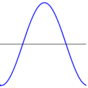
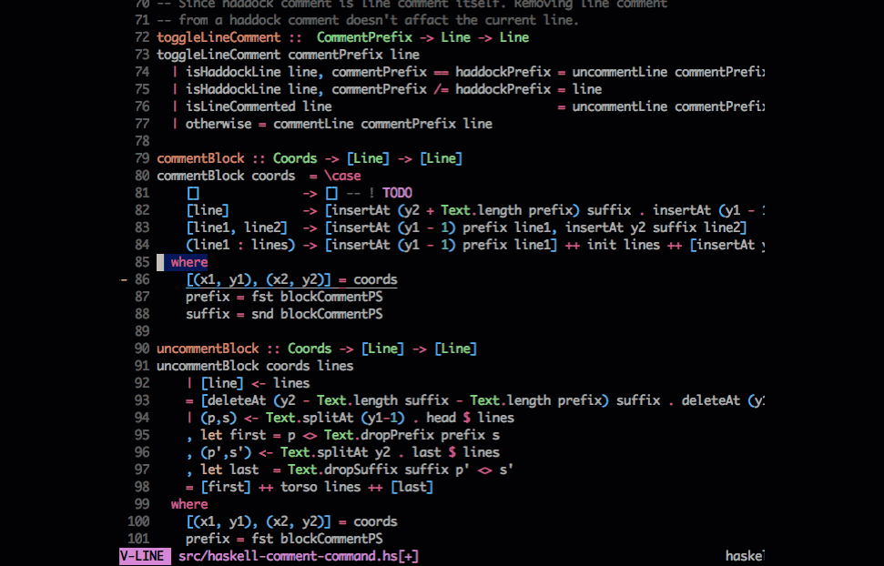

<h1> Welcome to my <a href="https://github.com/ManindraDeMel">profile</a> </h1>
</h1>

### 📬 Find me at
 

### 🏖️ My Life...   
I'm an **Undergrad Student🎓 [@Australian National University](https://www.anu.edu.au/)** pursuing Computer Science. I'm a **Tech Enthusiast 💻** but this isn't limited to just building software. I Love building computers, modifying cars 🚗 and Maths!! ♾️   

## ⚡️ A Few Quick Facts

- 🔭 I’m currently working at [Stomble](https://www.linkedin.com/company/stomble/?originalSubdomain=au) as a backend developer, and we're building something exciting... 😉
- 🌱 I’m currently learning APL & Other Array oriented languages 🤓

-   I enjoy working on
  - 📊 Machine Learning & Data Science
  - 📐 Learning new and interesting computer science topics
- 👯 I’m looking to collaborate on anything really, give me a challenge.
- 💬 Ask me about ML, Backend Development, DevOps and most languages 
- 📙 Check out my [Resume](https://www.linkedin.com/in/manindra-de-mel-413a79160/)
- 🎉 Fun-Fact: I ❤️ Maths. Specfically I'd love to learn more about the different types of logic, type theory, group theory etc..

  
### 🖥️ My DevSetup
    

### ⚙️ Some Tool and Tech I use
<code></code>
<code></code>
<code></code>
<code></code>
<code></code>
<code></code>
<code></code>
<code></code>
<code></code>

### 🚀 Quick Stats

